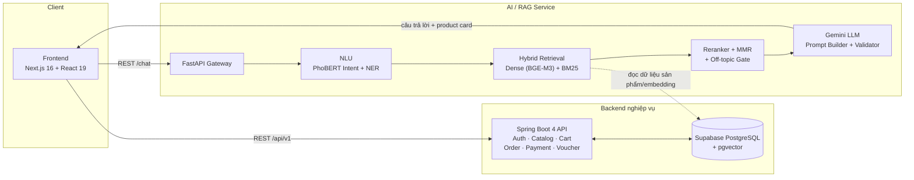
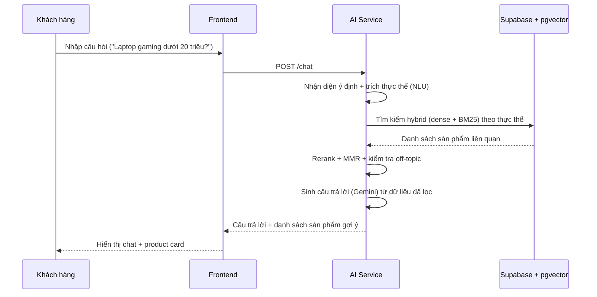
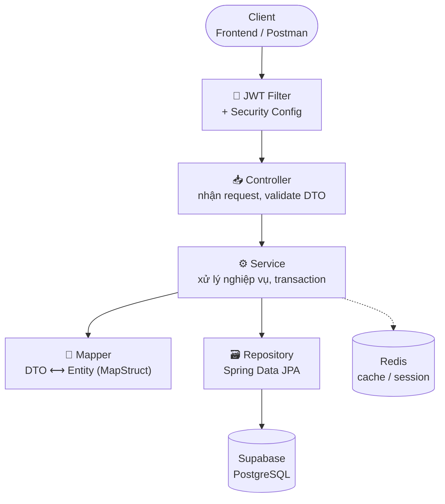
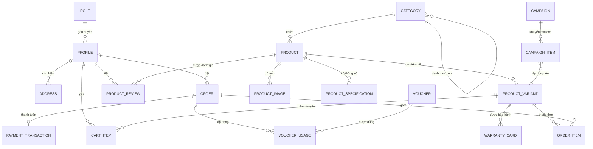

<div align="center">

# 🛒 ShopWise
### Website bán thiết bị điện tử tích hợp Chatbot tư vấn RAG

*Đồ án Thực tập Tốt nghiệp (TTTN_D35) — Học viện Công nghệ Bưu chính Viễn thông (PTIT)*


<br/>

[Giới thiệu](#-giới-thiệu-chung) •
[Vì sao làm vậy](#-vì-sao-làm-theo-hướng-này) •
[Kiến trúc Backend](#️-kiến-trúc-backend-spring-boot) •
[Database](#️-sơ-đồ-cơ-sở-dữ-liệu-rút-gọn) •
[Giao diện](#-giao-diện) •
[Tech Stack](#️-công-nghệ-sử-dụng) •
[Cài đặt](#-hướng-dẫn-cài-đặt--khởi-chạy) •
[Team](#-thành-viên-nhóm--phân-công)

</div>

---

## 📖 Giới thiệu chung

ShopWise là website bán thiết bị điện tử (điện thoại, laptop, phụ kiện), có 🤖 **chatbot tư vấn sản phẩm dùng RAG** (Retrieval-Augmented Generation). Chatbot không trả lời bằng kiến thức có sẵn của LLM mà truy xuất dữ liệu sản phẩm thật trong hệ thống rồi mới sinh câu trả lời, tránh trường hợp bịa thông số hay giá sản phẩm không tồn tại.

Hệ thống gồm 3 phần tách riêng: 🖥️ frontend (Next.js), ⚙️ backend nghiệp vụ (Spring Boot) và 🧠 AI service (FastAPI, Python), giao tiếp với nhau qua REST API. Dữ liệu lưu chung trên PostgreSQL/Supabase, dùng luôn extension `pgvector` để lưu vector embedding thay vì phải chạy thêm một vector database riêng.

---

## 💡 Vì sao làm theo hướng này

🔀 **Chatbot dùng Hybrid Search thay vì search thường**: câu hỏi của khách được nhận diện ý định và trích thực thể (tên sản phẩm, thương hiệu, mức giá...) qua module NLU dựa trên PhoBERT trước, sau đó mới tìm sản phẩm bằng cách kết hợp tìm kiếm theo vector (dense embedding) và tìm kiếm theo từ khóa (BM25). Làm vậy vì tìm theo từ khóa đơn thuần dễ bỏ sót câu hỏi diễn đạt khác cách viết trong dữ liệu, còn tìm theo vector đơn thuần lại dễ trả về sản phẩm không đúng ý khi người dùng hỏi con số cụ thể (giá, dung lượng...). Kết hợp cả hai giúp bù được nhược điểm của nhau.

🚫 **Chatbot có cơ chế từ chối câu hỏi ngoài phạm vi (off-topic gate)**: nếu câu hỏi không liên quan đến sản phẩm điện tử, hệ thống báo không hỗ trợ thay vì để LLM tự bịa câu trả lời.

🗄️ **Dùng pgvector trên Supabase thay vì Chroma/Milvus riêng**: nhóm chỉ có 3 người và thời gian làm khoảng 4 tuần, nên ưu tiên gộp lưu trữ vector vào chung một database Postgres đang dùng sẵn, giảm phần hạ tầng phải cài đặt và vận hành thêm.

🧩 **Tách 3 service riêng (frontend/backend/AI) thay vì gộp chung 1 service**: AI service dùng Python vì các thư viện NLP, embedding, LLM chủ yếu có sẵn cho Python; backend nghiệp vụ dùng Java Spring Boot vì cần RBAC, transaction cho đơn hàng/thanh toán chặt chẽ. Tách riêng để hai service phát triển độc lập, không phụ thuộc lẫn nhau về công nghệ.

### 🗺️ Sơ đồ kiến trúc tổng quan



### 🔄 Luồng xử lý một câu hỏi chatbot



---

## 🏗️ Kiến trúc Backend (Spring Boot)

Backend theo kiến trúc phân lớp (layered) chuẩn Spring: request đi qua Security Filter → Controller → Service → Repository → Database, không cho Controller gọi thẳng Repository.



**Các nhóm module chính** (theo Controller): `Auth` (đăng nhập, OTP, OAuth2 Google) · `Catalog` (Category, Product, Variant) · `Cart` · `Order & Payment` (VNPay, Stripe) · `Voucher & Campaign` · `Warranty` · `News` · `Review` · `Report` · `Admin/*` (quản trị riêng cho từng module trên).

---

## 🗄️ Sơ đồ cơ sở dữ liệu (rút gọn)

Database có 46+ bảng (Flyway V1 → V46+), sơ đồ dưới đây rút gọn theo nhóm nghiệp vụ chính, không vẽ đủ 46 bảng và cột chi tiết — xem đầy đủ tại `data/DB_Design.md`.



> 💡 Ngoài nhóm bảng trên, hệ thống còn có nhóm **AI/RAG** (`product_chunks` + pgvector), nhóm **CMS trang chủ** (`home_banner`, `brand_logo`, `home_featured_category`) và nhóm **vận hành** (`audit_log`, `system_config`, `inventory_adjustment`) — không vẽ chung để sơ đồ dễ đọc.

<div align="right"><a href="#-shopwise">⬆ về đầu trang</a></div>

---

## 🎨 Giao diện

Giao diện làm theo bản thiết kế Figma của nhóm ([xem thiết kế](https://www.figma.com/design/TnK2x8TfDJhYik4GMjO4AK/%C4%90%E1%BB%93-%C3%A1n-th%E1%BB%B1c-t%E1%BA%ADp)), theo hướng tối giản, chia lưới rõ ràng thay vì trang trí nhiều màu mè.

| Khu vực | Mô tả |
| --- | --- |
| 🧭 **Header** | Menu danh mục, ô tìm kiếm, giỏ hàng, nút chuyển Dark/Light mode — cố định trên đầu trang, có menu riêng cho mobile |
| 🏠 **Trang chủ** | Banner giới thiệu chatbot AI, dải chạy chữ khuyến mãi, khối sản phẩm bán chạy (nhãn giảm giá + đánh giá sao), gợi ý theo nhu cầu (làm việc/gaming...), khối tin tức công nghệ |
| 🔐 **Đăng nhập/Đăng ký** | Form đăng ký kiểm tra độ mạnh mật khẩu theo thời gian thực, quên mật khẩu qua email, đặt lại mật khẩu có kiểm tra khớp ngay lúc nhập |
| 🦶 **Footer** | Nhiều cột liên kết, đăng ký nhận tin khuyến mãi, hiển thị phương thức thanh toán hỗ trợ |

---

## 🛠️ Công nghệ sử dụng

### 🖥️ Frontend
| | |
| --- | --- |
| Framework | [Next.js 16 (canary, App Router)](https://nextjs.org/) trên React 19 + TypeScript |
| Styling | Tailwind CSS v4, Radix UI Primitives, `tailwind-merge`, `next-themes` (Dark/Light mode) |
| State & Data Fetching | Zustand/Jotai, TanStack React Query v5, Axios, React Hook Form + Zod |
| Thanh toán | Stripe (`@stripe/react-stripe-js`), VNPay (qua backend) |
| Khác | `react-markdown` (hiển thị câu trả lời chatbot), `js-cookie`, `date-fns` |

### ⚙️ Backend
| | |
| --- | --- |
| Framework | Java 17, Spring Boot 4.0.7 (Gradle, Groovy DSL) |
| Persistence | Spring Data JPA, Hibernate 7.2, MapStruct (mapping DTO ⟷ Entity) |
| Database | PostgreSQL / Supabase (Session Pooler), Flyway migrations (46+ version, `ddl-auto: validate`) |
| Security | Spring Security, JWT (access token + refresh token cookie), Google OAuth2, RBAC (Role–Permission) |
| Khác | Spring Data Redis (cache/session), Spring Mail (OTP qua Gmail SMTP), springdoc-openapi (Swagger UI), VNPay + Stripe payment integration |

### 🧠 AI & RAG Pipeline (`ai/` — service Python độc lập, FastAPI)
| | |
| --- | --- |
| LLM Generation | Google Gemini (`google-generativeai`), prompt builder + response validator riêng (`chatbot/`) |
| NLU | PhoBERT-based Intent Classifier + rule engine + query understanding (`nlu/`) |
| Retrieval | Hybrid Search — Dense embedding (`sentence-transformers`, BGE-M3) kết hợp BM25 sparse (`rank_bm25`) + Cross-Encoder Reranker + MMR + Off-topic gate (`core/`) |
| Vector Store | pgvector trực tiếp trên Supabase Postgres (không dùng Chroma/Milvus riêng) |
| Admin API | Quản lý sản phẩm/chunk, đồng bộ dữ liệu, thống kê hội thoại, xem log (`admin/`) |
| Data pipeline | Crawler thu thập dữ liệu sản phẩm từ FPTShop (`crawler/`), dữ liệu thô/đã xử lý lưu ở `data/` |

> ℹ️ **Lưu ý**: repo hiện còn giữ 2 phiên bản AI cũ hơn (`ai-system/`, `ai-v3/`) làm tư liệu tham khảo/lịch sử phát triển — service đang chạy chính thức là thư mục **`ai/`** (AI v4).

<div align="right"><a href="#-shopwise">⬆ về đầu trang</a></div>

---

## 📁 Cấu trúc thư mục

<details>
<summary><b>Bấm để xem cây thư mục đầy đủ</b> 🌳</summary>

```text
TTTN_D35/
├── ⚙️ backend/                # Mã nguồn Spring Boot Backend Service
│   ├── build.gradle
│   ├── docker-compose.yml      # Redis local + Redis Commander UI
│   └── src/
│       ├── main/java/ptithcm/tttnd35backend/
│       │   ├── controller/     # Auth, Catalog, Cart, Order, Payment, Voucher, Campaign,
│       │   │                   #   Warranty, News, Review, Report, Admin/* (30+ controller)
│       │   ├── service/ + service/impl/
│       │   ├── entity/         # Product, Order, Campaign, Voucher, Warranty, News...
│       │   ├── repository/ + repository/spec/ + repository/projection/
│       │   ├── mapper/         # MapStruct
│       │   ├── dto/            # request/ + response/
│       │   └── config/         # security/, jwt/
│       └── main/resources/db/migration/   # Flyway V1 → V46+
├── 🧠 ai/                     # Service AI/RAG hiện hành (FastAPI)
│   ├── main.py                 # Entry point
│   ├── api/                    # FastAPI router tổng
│   ├── chatbot/                # LLM client, prompt builder, session, response validator
│   ├── core/                   # BM25, embeddings, reranker, retriever, MMR, off-topic gate
│   ├── nlu/                    # PhoBERT intent + NER, rule engine, query understanding
│   ├── admin/                  # API quản trị: products, chunks, sync, stats, logs, config
│   ├── pipelines/              # Data ingestion/chunking pipeline
│   └── static/                 # Chat widget test UI
├── 🕰️ ai-system/              # (Legacy) phiên bản AI cũ hơn — tham khảo lịch sử
├── 🕰️ ai-v3/                  # (Legacy) phiên bản AI v3 — tham khảo lịch sử
├── 🕷️ crawler/                # Crawler thu thập dữ liệu sản phẩm (server, dashboard, script)
├── 🗂️ data/                   # Dữ liệu crawl & tài liệu chuẩn bị RAG
│   ├── DB_Design.md             # Thiết kế CSDL đầy đủ (ERD, chuẩn hóa, class diagram)
│   ├── processed/               # Dữ liệu đã chuẩn hóa/chunk
│   └── raw/                     # Dữ liệu thô cào từ e-commerce
├── 🖥️ frontend/               # Mã nguồn Next.js 16 Frontend App
│   ├── app/                    # App Router: trang khách hàng + /admin/* (CMS, orders, ai-management...)
│   ├── components/, shared/    # Component & layout dùng chung
│   ├── hooks/                  # Custom React Hooks (TanStack Query hooks, useAuth...)
│   ├── services/               # API call services
│   └── store/                  # Zustand store
├── 📄 docs/                   # Tài liệu bổ sung (pricing rule, ...)
└── README.md
```

</details>

---

## 🚀 Hướng dẫn cài đặt & khởi chạy

### ✅ Yêu cầu hệ thống
- **Node.js**: `v18+` (Khuyến nghị `v20+`)
- **Package Manager**: `npm`
- **JDK**: `Java 17` (Cho phần Backend, dùng Gradle Toolchain)
- **Python**: `3.10+` (Cho phần AI/RAG Service)
- **Database**: PostgreSQL / Supabase Instance (đã bật extension `pgvector`, `pgcrypto`)
- **Redis**: chạy local qua `docker-compose.yml` trong `backend/`

---

### 1️⃣ Khởi chạy Frontend (Next.js 16)

```bash
# Di chuyển vào thư mục frontend
cd frontend

# Cài đặt các thư viện phụ thuộc
npm install

# Khởi chạy server phát triển
npm run dev
```

Mở trình duyệt truy cập: `http://localhost:3000`

---

### 2️⃣ Khởi chạy Backend (Spring Boot)

```bash
# Di chuyển vào thư mục backend
cd backend

# Khởi chạy Redis (local, qua Docker)
docker-compose up -d

# Chạy ứng dụng với Gradle Wrapper
./gradlew bootRun
```

Backend RESTful API sẽ khởi chạy tại: `http://localhost:8080/api/v1` — Swagger UI: `http://localhost:8080/swagger-ui.html`

---

### 3️⃣ Khởi chạy AI/RAG Service (FastAPI)

```bash
# Di chuyển vào thư mục ai
cd ai

# Tạo virtual environment & cài đặt thư viện
python -m venv venv
venv\Scripts\activate      # Windows
# source venv/bin/activate # macOS/Linux
pip install -r requirements.txt

# Tạo file .env từ mẫu và điền GEMINI_API_KEY, thông tin kết nối Supabase
copy .env.example .env      # Windows
# cp .env.example .env      # macOS/Linux

# Khởi chạy server
python main.py
```

AI Service sẽ khởi chạy tại: `http://localhost:8000`

---

## 📸 Hình ảnh minh họa giao diện

<div align="center">

| 🏠 Trang chủ | 🔐 Đăng nhập |
| :---: | :---: |
| *Hero Banner & lưới bố cục theo Figma* | *Form đăng nhập chuẩn 448px* |
| 📝 Đăng ký | 🔁 Đặt lại mật khẩu |
| *Kiểm tra độ mạnh mật khẩu real-time* | *Kiểm tra khớp mật khẩu động* |

<sub>📌 Ảnh chụp màn hình thật sẽ được nhóm bổ sung khi frontend hoàn thiện các trang.</sub>

</div>

---

## 👥 Thành viên nhóm & phân công

- 🎓 **Dự án**: Đồ án Thực tập Tốt nghiệp PTIT (TTTN_D35)
- 📦 **Repository**: [GitHub - quocluongg/TTTN_D35](https://github.com/quocluongg/TTTN_D35)

| Thành viên | GitHub | Phụ trách |
| --- | --- | --- |
| 🧠 Quốc Lương | [`@quocluongg`](https://github.com/quocluongg) | AI / RAG System (Python, FastAPI) |
| ⚙️ Hải Triều | [`@HaiTrieu186`](https://github.com/HaiTrieu186) | Backend (Spring Boot) |

---

## 📝 Giấy phép

Dự án phục vụ mục đích học thuật (Đồ án Thực tập Tốt nghiệp), không phát hành thương mại.

<div align="center">

⭐ *Nếu thấy repo hữu ích, để lại một star nhé!*

Made with ☕ + 🍜 by nhóm TTTN_D35

[⬆ Về đầu trang](#-shopwise)

</div>